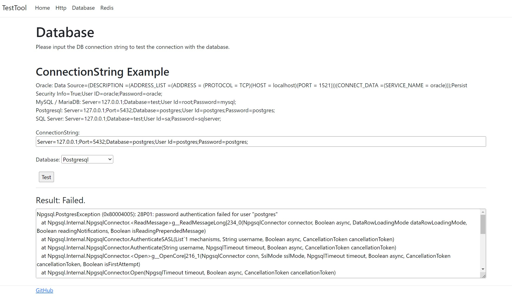

# ASP Network Test Tool

This is a network testing tool designed for cloud environments.
It allows you to test HTTP access, database access (Oracle, MySQL, MariaDB, PostgreSQL, SQL Server), and connections to Redis.

クラウド向けネットワークテストツールです。

---


## The functionalities are as follows:

- HTTP access testing
- Database access testing (Oracle, MySQL, MariaDB, PostgreSQL, SQL Server)
- Testing connections to Redis.


## 機能内容

- HTTPアクセステスト

- DB接続テスト
  - Oracle
  - MySQL
  - MariaDB
  - Postgresql
  - SQL Server
  
- Redis接続テスト

---

## Usage Instructions

- Dotnet

```
  dotnet run
```

- [Docker](https://hub.docker.com/r/nobuomiura/asp-network-test-tool)
```
  docker pull nobuomiura/asp-network-test-tool
```

---

